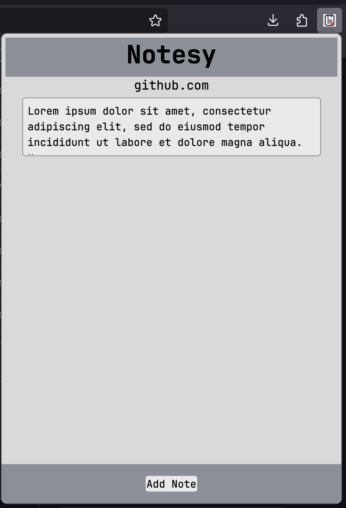
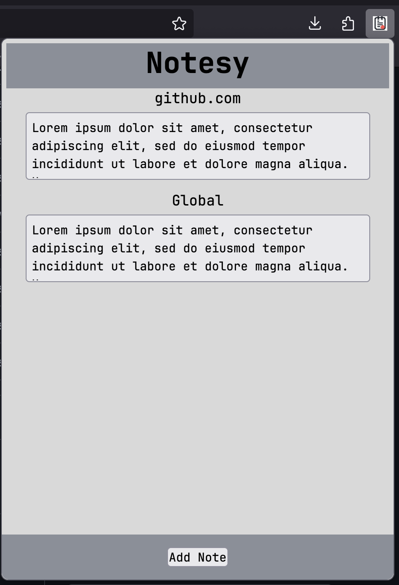

# Notesy
Notesy is a Firefox browser extension that helps users take better notes while browsing the web. 

Notesy allows users to create notes for specific web pages. When the user navigates to that web page, the notes appear.

Along with allowing users to create notes local to the current webpage, users can create notes global to all webpages.

More features will be added over time. Here is a short list of features to come:
- Pin notes having them show up at top of list.
- Turn notes into sticky notes within web browser.
- Store notes in a MongoDB server.
- Share note content through email. 